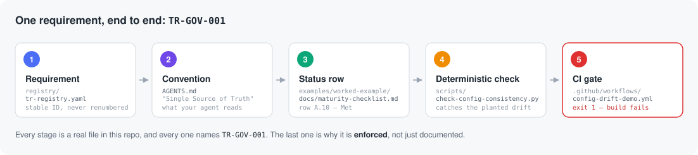

# Agent Engineering Standards

AI coding agents take the shortest path. This repo gives yours rules it reads,
and gives your CI the deterministic checks that catch it when it takes one anyway.

[](https://github.com/onesimplecode/agent-engineering-standards/actions/workflows/release-check.yml)
[](https://github.com/onesimplecode/agent-engineering-standards/actions/workflows/agent-permission-guard-demo.yml)
[](https://github.com/onesimplecode/agent-engineering-standards/actions/workflows/config-drift-demo.yml)

-blue)


**7 scripts · 14 worked examples · 9 templates · 38 requirement IDs · 136 tests.**
Every script runs on the Python 3 standard library alone — nothing to install.
Every rule here was extracted from a failure in a running system, not invented
for a blog post.

**Maintained by** [David Lin](https://github.com/onesimplecode) · MIT · [v0.10.0](CHANGELOG.md)

## See it catch something (30 seconds)

Wildcard install/exec grants in an agent allowlist are a security boundary, not
a convenience — a prompt-injected session can invoke anything allowlisted.

```bash
git clone https://github.com/onesimplecode/agent-engineering-standards
cd agent-engineering-standards
python3 scripts/agent-permission-guard.py \
  --settings examples/agent-permission-guard/settings.example.json
```

```
FORBIDDEN [wildcard_dangerous_verb] examples/agent-permission-guard/settings.example.json: 'Bash(pip install:*)' -- wildcard write/install/exec/network grants are never allowed
UNREVIEWED examples/agent-permission-guard/settings.example.json: 'Bash(ruff check:*)' -- not in REVIEWED_BASELINE; add it to scripts/agent-permission-guard.py in this PR if intentional
```

Exit code 1. No install step, no config, no API key — the guard hard-codes its
own reviewed baseline, so widening the allowlist and approving the widening land
in the same reviewable diff. Full walkthrough:
[`examples/agent-permission-guard/`](examples/agent-permission-guard/).

Second proof, ten seconds: LLM output that fails open through
`bool("false") is True` —
[`examples/strict-output-schema/`](examples/strict-output-schema/).

## Start here

Copy [`AGENTS.starter.md`](AGENTS.starter.md) into your project root as
`AGENTS.md`. Seven rules, one page, no vocabulary to learn — Cursor, Claude
Code, Codex, and similar harnesses read it today. Graduate to the full
[`AGENTS.md`](AGENTS.md) when you want requirement IDs, threat modeling,
provenance hygiene, and multi-agent isolation.

Then:

1. **Prove one failure mode** — run the example above (or any from the gallery).
   You should see CI-style exit code 1 on a planted bad grant.
2. **Point a script at your own tree** — the five adoption scripts in
   [Reference scripts](#reference-scripts) each take a path argument; the exact
   flag per script is shown there.
3. **Add what you need** — templates under [`templates/`](templates/), role
   specs under [`agents/`](agents/).

No fork required. Read the model when you want depth:
[`docs/ai-engineering-operating-model.md`](docs/ai-engineering-operating-model.md).
How this layers with agent-skills / Cursor rules:
[`docs/agent-skills-integration.md`](docs/agent-skills-integration.md).

## Why this exists

AI coding agents default to the shortest path: skip tests, leak context across
trust boundaries, drift config and docs, and loop without budgets. Senior
engineers prevent those failures with standards, reviews, and deterministic
checks. This repository packages that discipline so you can drop it into a real
project.

## Who this is for

| For you if… | Not for you if… |
|-------------|-----------------|
| You already use AI coding agents and feel drift, over-broad tool grants, or “it worked in chat” false confidence | You want a hosted agent platform, a skill marketplace, or a RAG product |
| You want **design-time** rules + **scriptable** checks, not more prompts | You need runtime policy engines (see Microsoft Agent Governance Toolkit for that layer) |
| You are fine copying templates and wiring one CI job | You want a one-click framework that ships an app |

## How a requirement becomes an enforced gate



Every stage above names `TR-GOV-001`, and every one is a file you can open. That
chain is the differentiator: design-time traceability — requirement IDs, PII
routing, loop contracts, trigger classification, and scriptable drift detection —
that *complements* [AGENTS.md](https://agents.md) and
[agent-skills](https://github.com/addyosmani/agent-skills). Walk a second
requirement end to end in [`examples/worked-example/`](examples/worked-example/).

## Example gallery

Each example plants a real failure, then catches it.

| Failure prevented | Example | Path |
|---|---|---|
| Wildcard / unreviewed agent tool grants | Permission guard | [`examples/agent-permission-guard/`](examples/agent-permission-guard/) |
| `bool("false")` fail-open on LLM fields | Strict output schema | [`examples/strict-output-schema/`](examples/strict-output-schema/) |
| Untrusted memory treated as instructions | Provenance trust tags | [`examples/provenance-trust-tags/`](examples/provenance-trust-tags/) |
| Security delimiters re-inlined and drifting | Spotlighting drift | [`examples/spotlighting/`](examples/spotlighting/) |
| Multi-agent isolation + self-report false passes | Compartmentalized agents | [`examples/compartmentalized-agents/`](examples/compartmentalized-agents/) |
| Credential theft, stale-event mutation, or replayed broker lease | Credential-isolated broker | [`examples/credential-isolated-broker/`](examples/credential-isolated-broker/) |
| Third-party skill markdown overriding core rules | Plugin skill trust | [`examples/plugin-skill-trust/`](examples/plugin-skill-trust/) |
| Open-world fetch without redirect-hop re-checks | SSRF allowlist | [`examples/ssrf-allowlist/`](examples/ssrf-allowlist/) |
| Unregistered model assumed safe for PII | Local-only model registry | [`examples/local-only-model-registry/`](examples/local-only-model-registry/) |
| Forked multi-runtime instruction drift | Thin pointer | [`examples/thin-pointer/`](examples/thin-pointer/) |
| Overclaiming workflow/gitignore “security” | Honest CI limits | [`examples/honest-ci-limits/`](examples/honest-ci-limits/) |
| Model-string drift across config and docs | End-to-end requirement trace | [`examples/worked-example/`](examples/worked-example/) |
| Rules that only work in one agent harness | Generated Cursor rules | [`examples/cursor-rules/`](examples/cursor-rules/) |
| Agent loops with no declared exit condition or budget | Engine interface | [`examples/engine-interface/`](examples/engine-interface/) |

## Reference scripts

Point these at **your** repo:

```bash
# Config / model-string drift
python3 scripts/check-config-consistency.py --root /path/to/your/repo --app YourApp

# Deferred-work tags (TECH-DEBT / POC-EXCEPTION)
python3 scripts/debt-report.py --path /path/to/your/repo

# Agent permission grants vs reviewed baseline
python3 scripts/agent-permission-guard.py --settings /path/to/your/settings.json

# Spotlighting constants not re-inlined
python3 scripts/spotlighting-drift-guard.py \
  --constants-file /path/to/your/constants.py --scan-root /path/to/your/src

# Export registry as Cursor project rules
python3 scripts/cursor-rules-adapter.py --out /path/to/your/repo/.cursor/rules
```

Maintainer / staging checks for *this* repository (release hygiene, `llms.txt`
drift): `python3 scripts/public-export-check.py .` and
`python3 scripts/llms-txt-generator.py --check`.

## What you get

| Included | Not included |
|----------|----------------|
| Portable agent conventions (`AGENTS.starter.md`, `AGENTS.md`, `agents/`) | Production runtime or hosted services |
| Machine-readable requirement registry (`registry/tr-registry.yaml`) | Full application frameworks |
| Governance & eval templates (ADR, impact assessment, maturity, LLM eval, completion checklist) | A replacement for `agent-skills` / prompt packs |
| Reference scripts (drift, debt tags, permission guard, spotlighting, release checks, Cursor rules, `llms.txt`) | Personal or private app data |
| Synthetic worked examples with CI demos | |

## Map of the repo

- [`AGENTS.starter.md`](AGENTS.starter.md) — seven-rule starter, the fastest adoption path
- [`AGENTS.md`](AGENTS.md) — full tool-neutral rules (data routing, loop contracts,
  triggers, untrusted content, deterministic checks)
- [`agents/`](agents/) — developer / reviewer / researcher role specs
- [`docs/ai-engineering-operating-model.md`](docs/ai-engineering-operating-model.md)
  — requirements, roles, artifacts, checks
- [`docs/requirements-implementation-map.md`](docs/requirements-implementation-map.md)
  — where each public requirement is enforced
- [`templates/`](templates/) — ADR, impact assessment, maturity, eval, threat model, completion checklist
- [`llms.txt`](llms.txt) — generated discovery manifest for this repo
  ([llmstxt.org](https://llmstxt.org))

## Contributing

See [CONTRIBUTING.md](CONTRIBUTING.md). Releases follow [ROADMAP.md](ROADMAP.md)
and [CHANGELOG.md](CHANGELOG.md).

## License

MIT — see [LICENSE](LICENSE). Third-party influences: [ATTRIBUTIONS.md](ATTRIBUTIONS.md).
